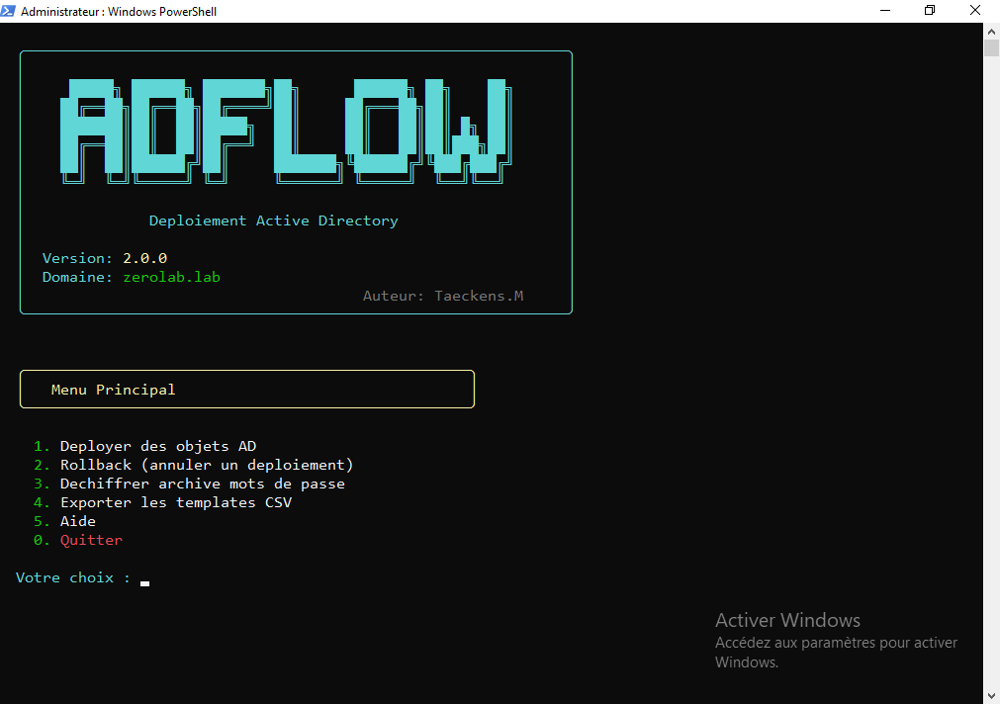
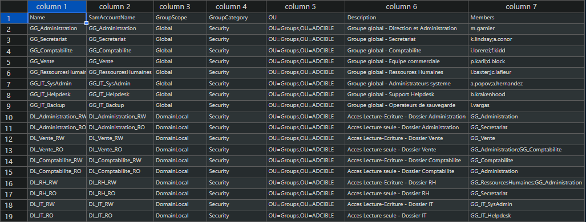
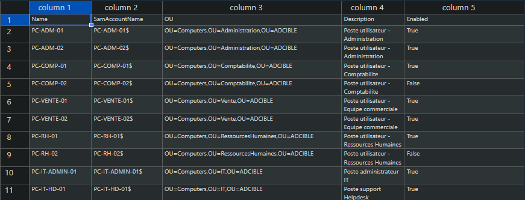

# ADFlow CLI


**Deploiement d'objets Active Directory depuis CSV** — Users, Groups, Computers en quelques commandes.

---

## Fonctionnalites

- Deploiement **Users**, **Groups**, **Computers** depuis CSV
- Mode **simulation** (WhatIf) pour tester sans modifier
- Creation automatique des **OUs manquantes**
- **Rollback** pour annuler un deploiement
- Export des mots de passe avec **chiffrement 7-Zip**
- Mise a jour d'objets existants

## Prerequis

- PowerShell 5.1+
- Module ActiveDirectory (RSAT)
- Machine jointe au domaine
- Droits AD appropries

## Demarrage rapide

```powershell
# 1. Exporter les templates CSV
.\Start-ADFlow.ps1 -ExportTemplate

# 2. Modifier les fichiers dans .\CSV\ avec vos donnees

# 3. Lancer l'interface interactive
.\Start-ADFlow.ps1
```



L'interface vous guide a travers toutes les etapes : validation, configuration, deploiement.


## Structure des CSV

| Type | Colonnes requises |
|------|-------------------|
| Users | SamAccountName, GivenName, Surname, OU |
| Groups | Name, SamAccountName, GroupScope, GroupCategory, OU |
| Computers | Name, SamAccountName, OU |





## Exemples

```powershell
# Exporter les templates
.\Start-ADFlow.ps1 -ExportTemplate

# Afficher la version
.\Start-ADFlow.ps1 -Version

# Afficher l'aide
.\Start-ADFlow.ps1 -Help
```

---

## Licence

MIT License

## Auteur

Matthieu Taeckens
